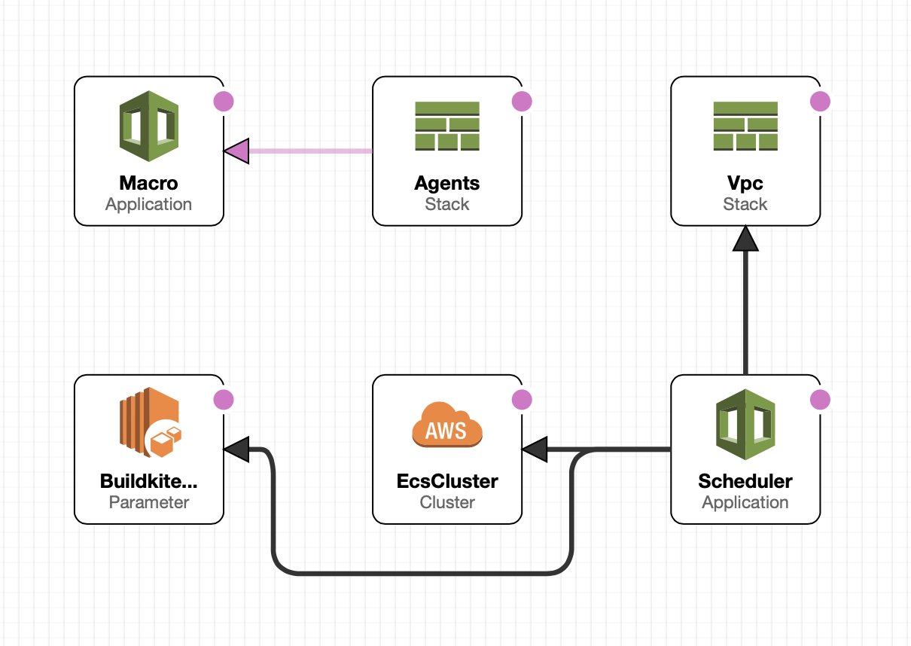

# Buildkite On-Demand

Schedule single-shot Buildkite Agents, on-demand, on ECS.

Buildkite On-Demand is an event driven Buildkite Agent scheduler. Built on the
Buildkite AWS EventBridge integration, containerised Buildkite Agents are
scheduled using Amazon Elastic Container Service to run on AWS Fargate. An agent
is created for each build and exits immediately on completion. There are no
polling agents so you only pay for the compute time you use.

This repository contains resources and documentation to help you configure an
AWS account to schedule and run agents for your Buildkite Organization in
response to builds.

## Set-up Instructions

Before deploying Buildkite On-Demand to your AWS account, configure the Amazon
EventBridge integration between your Buildkite and AWS accounts. See the
[Buildkite Documentation](https://buildkite.com/docs/integrations/amazon-eventbridge)
for how to do this.

It is best practice to run your continuous integration in a separate AWS
account. Consider creating a new AWS account in your AWS Organization for the
EventBridge integration.

Once you have associated your Buildkite Partner Event Source with an Amazon
EventBridge bus, you are ready to deploy the on-demand stack to your AWS
Account. You can deploy this stack using the AWS CloudFormation Console in a
browser or the AWS CLI in your terminal.

### Deploy using the AWS CloudFormation web console

[](https://console.aws.amazon.com/cloudformation/home#/stacks/new?stackName=buildkite-on-demand&templateURL=https://buildkite-on-demand-us-east-1.s3.amazonaws.com/on-demand/latest/template.yml)

The CloudFormation console will ask you for values for the following parameters:

* **Stack Name**: Must be unique per account per region. Use something
descriptive, the default value of buildkite-on-demand is fine.
* **Parameter BuildkiteAgentToken**: A Buildkite Agent Registration token for
this deployment to use. This will be stored in a `String` type AWS SSM
Parameter. See the
[Buildkite Agent Tokens Documentation](https://buildkite.com/docs/agent/v3/tokens)
for details.
* **Parameter BuildkiteQueue**: The name of the Buildkite queue this stack will
service. You will use this queue name in your Buildkite Pipeline Agent Query
rules e.g. `queue=my-queue-name`.
* **Parameter EventBridgeBusName**: The name of an Amazon EventBridge Bus
associated with a Buildkite Partner Event source **NB** ensure you provide the
name of the EventBus name _not_ the EventBus ARN.
* **Parameter VpcSubnetIds**: Optional, a comma separated list of VPC subnet IDs
to schedule agents in. If left blank the default simple VPC, suitable for most
use cases, will be created automatically.

When creating the stack you will need to check the option to acknowledge that
the stack creates custom IAM roles.

### Deploy using the AWS Serverless Application Model command line interface

The AWS SAM CLI is an extension of the AWS CLI that will auto-upload any
substacks before applying your template. See the Amazon documentation for help
[installing the AWS SAM CLI](https://docs.aws.amazon.com/serverless-application-model/latest/developerguide/serverless-sam-cli-install.html). These instructions were
written using SAM Version 0.47.0.

```bash
$ sam deploy --guided --template-file template/template.yml
```

This command will package and deploy the on-demand template to your AWS account,
and present you with a series of prompts:

* **Stack Name**: The name of the CloudFormation stack to deploy. This should
be unique to your account and region, something like
`buildkite-on-demand`. You will use this stack name when updating your template
in the future.
* **AWS Region**: The AWS region you want to deploy your on-demand agents to. Buildkite On-Demand can be deployed to multiple regions allowing you to target specific
regions using Buildkite Agent Query Rules.
* **Parameter EventBridgeBusName**: The name of the Amazon EventBridge Bus
associated with a Buildkite Partner Event source **NB** you provide the name of
the EventBus name _not_ the EventBus ARN.
* **Parameter BuildkiteQueue**: The name of the Buildkite queue this stack will
service. You will use this queue name in your Buildkite Pipeline Agent Query
rules e.g. `queue=my-queue-name`.
* **Parameter BuildkiteAgentToken**: A Buildkite Agent Registration token for
this deployment to use. This will be stored in a `String` type AWS SSM
Parameter. See the
[Buildkite Agent Tokens Documentation](https://buildkite.com/docs/agent/v3/tokens)
for details.
* **Parameter VpcSubnetIds**: Optional, a comma separated list of VPC subnet IDs
to schedule agents in. If left blank the default simple VPC, suitable for most
use cases, will be created automatically.
* **Confirm changes before deploy**: If set to yes, any change sets will be
shown to you before execution for manual review. If set to no, the AWS SAM CLI
will automatically deploy changes.
* **Allow SAM CLI IAM role creation**: You must answer **no** to this prompt to
customise the capabilities.
* **Capabilities [['CAPABILITY_IAM']]**: Enter
`CAPABILITY_IAM CAPABILITY_AUTO_EXPAND` to grant permission to create IAM roles
and use the CloudFormation Macro to transform the agent substack.
* **Save arguments to samconfig.toml**: Set to yes so your choices are saved to
a configuration file inside the project. In the future you can just re-run
`sam deploy` without parameters to deploy changes.

# Modular Design

The default On-Demand template combines several components to give you a simple
off the shelf experience. If you want to customise how these components are
combined, you can fork the [template repository](https://github.com/keithduncan/buildkite-on-demand-template).



The default template includes:

- A simple VPC with two public subnets and an Internet Gateway.
	- You can override this behaviour by providing a comma separated list of
	VPC Subnet IDs in the optional `VpcSubnetIds` parameter.
	- For more complex VPC designs or you may want to swap out the entire VPC
	substack with something of your own design, or `!ImportValue` from an
	existing VPC CloudFormation stack.
- A `String` SSM Parameter for your Buildkite Agent Registration Token.
	- CloudFormation cannot currently create `SecureString` parameters, if you
	want to store this token securely you can create it yourself and pass a
	different parameter path to the `agent-scheduler` stack.
- An `agents` substack and CloudFormation Macro.
	- Using a substack to define your agent task definitions and task roles
	ensures your infrastructure is continuously deployable. The CloudFormation
	Macro makes writing these task definitions easy. This component is
	entirely optional, you could create your task definitions using the
	technology stack you are most comfortable with.

# Subprojects

## agent-scheduler

[agent-scheduler](agent-scheduler) is an [AWS SAM](https://aws.amazon.com/serverless/sam/)
project which configures the AWS resources needed to respond to Amazon
EventBridge events from Buildkite and schedule agents on ECS.

## agent-composer

[agent-composer](agent-composer) is a collection of AWS CloudFormation templates
to help create ECS Task Definitions that can be scheduled on-demand by
[agent-scheduler](#agent-scheduler).

### agent-composer/transform

[agent-composer/transform](agent-composer/transform) is an AWS CloudFormation
Macro that makes writing Buildkite Agent `AWS::ECS::TaskDefinitions` simple.

## template

[template] is a git submodule for [keithduncan/buildkite-on-demand-template](https://github.com/keithduncan/buildkite-on-demand-template).
This is a template repository so forks are disconnected from this repository.
